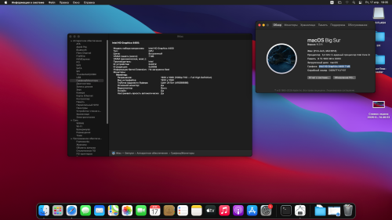

# Gigabyte-H81-DS2-Hackintosh
## H81M-DS2-Hackintosh

OpenCore EFI folder for mainboard Gigabyte H81M-DS2

 

## Sections:
[PC specification](#pc-specification)

[Compatible with](#compatible-with)

[What is working](#what-is-tested-and-working)

[Thanks](#thanks)

## PC specification

| Part  | Info |
| ------------- | ------------- |
| Mainboard | Gigabyte H81M-DS2  |
| CPU:  | Intel Core i3-4130 (Haswell, 2c/4t)  |
| RAM:  | 8GB (2x4GB 1600MHz DDR3)  |
| GPU:  | Intel HD 4400 |
| Disk:  | WD Blue 500GB  |
| Network: | Realtek RTL8111F |
| Sound:  | Realtek ALC887 (best layout-id in my build is 3)  |
| SMBIOS:  | iMac14,4  |

| macOS |
| ------------- |
|   |

## Compatible with

- [x] macOS Monterey Beta 1
- [x] macOS Big Sur (tested, working 100%)
- [x] macOS Catalina
- [x] macOS Mojave
- [x] macOS High Sierra
- [x] macOS Sierra
- [x] Mac OS X El Captain

Notes:

If you tested other macOS feel free to say about support!

(*): macOS 12 Monterey does not support iMac15,1 or older SMBIOS, use iMac16,1 (if you only have iGPU) or iMac17,1 (if you have dGPU).

(**): Apple dropped support for Kepler NVIDIA graphics cards since Monterey Beta 7, so you need be cautious, if you in Monterey < Beta 6, don't update to Beta 7 or just go back to earlier version like Big Sur, Catalina,...

## What is tested and working

- [x] Ethernet (en0)
- [x] Services (App Store, Apple Music,...)
- [x] Graphics card*
- [x] Intel QuickSync/Hardware Acceleration
- [x] USB 2.0/3.0

Notes: 

(*): GT730 (Kepler) is natively support in Catalina, other NVIDIA card please check before install Mojave or above.

(*) VGA is unsupported, use dGPU instead

## Thanks
+ [dtcu0ng](https://github.com/dtcu0ng/H81M-DS2-Hackintosh) for original readme
+ [Dortania](https://dortania.github.io/OpenCore-Install-Guide/) for OpenCore guides
